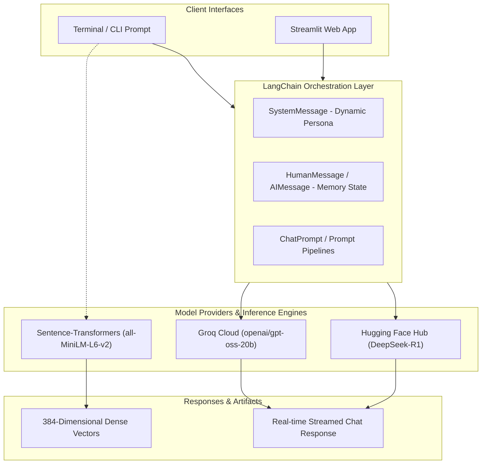

<div align="center">

# ⚡ Generative AI Playground & Toolkit

<p align="center">
  <strong>A modular showcase of Generative AI architectures, multi-persona conversational agents, Hugging Face DeepSeek integrations, and dense vector embeddings powered by LangChain & Streamlit.</strong>
</p>

<p align="center">
  <a href="https://www.python.org/"></a>
  <a href="https://www.langchain.com/"></a>
  <a href="https://groq.com/"></a>
  <a href="https://huggingface.co/"></a>
  <a href="https://streamlit.io/"></a>
  <a href="LICENSE"></a>
</p>

<p align="center">
  <a href="#-features">Features</a> •
  <a href="#-architecture">Architecture</a> •
  <a href="#-repository-structure">Structure</a> •
  <a href="#-quick-start">Quick Start</a> •
  <a href="#-usage-guide">Usage Guide</a> •
  <a href="#-environment-configuration">Configuration</a> •
  <a href="#-roadmap">Roadmap</a>
</p>

---

</div>

## 🌟 Overview

Welcome to the **Generative AI Playground**! This repository serves as a hands-on laboratory exploring modern Large Language Models (LLMs), conversational memory management, persona-conditioned prompting, Hugging Face open models, and semantic vector embeddings.

Whether you want to test high-speed inference on Groq LPUs, experiment with DeepSeek reasoning models, generate dense vector embeddings for semantic search, or interact through a Streamlit UI, this repository provides clean, plug-and-play Python implementations.

---

## ✨ Features

- ⚡ **Ultra-Fast LLM Inference**: Direct integration with [Groq](https://groq.com/) using `langchain-groq` for near-instant response times with models like `openai/gpt-oss-20b`.
- 🎭 **Dynamic Persona Engine**: Context-driven conversational agents capable of switching system instructions (Angry, Sad, Funny, Helpful) on the fly.
- 🖥️ **Interactive Streamlit Web Dashboard**: A modern chat UI with reactive session state management, persona toggles, and seamless message history rendering.
- 🔮 **Hugging Face Hub Integration**: Cloud-based serverless text generation featuring `deepseek-ai/DeepSeek-R1` via `HuggingFaceEndpoint` and `ChatHuggingFace`.
- 🧬 **Dense Vector Embeddings**: Sentence-level vector representations generated via `sentence-transformers/all-MiniLM-L6-v2` for semantic search, clustering, and RAG pipelines.
- 🧱 **Future-Ready Foundation**: Pre-configured setup for Google Gemini (`langchain-google-genai`), Mistral AI (`langchain-mistralai`), and multi-agent workflows with `langgraph`.

---

## 🏗️ Architecture

The following diagram illustrates how user interactions flow through the system:



---

## 📂 Repository Structure

```text
Generative_AI/
│
├── CHAT_MODEL/                     # Conversational LLM pipelines & interfaces
│   ├── chat.py                     # Minimal one-shot Groq chat invocation
│   ├── chatbot.py                  # Stateful CLI chatbot with memory & system prompts
│   ├── multichat.py                # Multi-persona interactive terminal chatbot
│   ├── UImultichat.py              # Full-featured Streamlit web application
│   └── huggingface.py              # Cloud inference with DeepSeek-R1 via Hugging Face Hub
│
├── EMBEDDING_MODEL/                # Vector embeddings and semantic processing
│   └── embeddings.py               # Hugging Face Sentence-Transformers vectorizer
│
├── .env.example                    # Template for required and optional API keys
├── .gitignore                      # Git ignore file for secrets and environments
├── requirements.txt                # Unified dependency specification
└── README.md                       # Repository documentation & guide
```

### Module Breakdown

| Directory / Script | Technology | Description |
| :--- | :--- | :--- |
| `CHAT_MODEL/chat.py` | LangChain + Groq | Quick starter script invoking Groq LLM with a single prompt. |
| `CHAT_MODEL/chatbot.py` | LangChain Core | Terminal-based conversational bot maintaining conversation history (`HumanMessage`, `AIMessage`). |
| `CHAT_MODEL/multichat.py` | LangChain Core | CLI bot with interactive persona selection (Angry, Sad, Funny, Helpful). |
| `CHAT_MODEL/UImultichat.py` | Streamlit + Groq | Web-based graphical UI with persona selection, session state, and chat bubbles. |
| `CHAT_MODEL/huggingface.py` | LangChain HuggingFace | Serverless inference with `deepseek-ai/DeepSeek-R1` using Hugging Face Hub endpoints. |
| `EMBEDDING_MODEL/embeddings.py` | Hugging Face Embeddings | Generates 384-dimensional dense vectors using `sentence-transformers/all-MiniLM-L6-v2`. |

---

## 🚀 Quick Start

### 1. Clone the Repository

```bash
git clone https://github.com/Omrawat11/Generative_AI.git
cd Generative_AI
```

### 2. Set Up a Virtual Environment

**On Windows (PowerShell):**
```powershell
python -m venv .venv
.\.venv\Scripts\Activate.ps1
```

**On macOS / Linux:**
```bash
python3 -m venv .venv
source .venv/bin/activate
```

### 3. Install Dependencies

```bash
pip install --upgrade pip
pip install -r requirements.txt
```

### 4. Configure Environment Variables

Create a `.env` file from the provided `.env.example`:

```bash
# Windows PowerShell:
Copy-Item .env.example .env

# Linux / macOS:
cp .env.example .env
```

Open `.env` and fill in your API credentials:

```env
GROQ_API_KEY="your_groq_api_key"
HF_TOKEN="your_huggingface_access_token"

# Optional Providers
GOOGLE_API_KEY="your_gemini_key"
MISTRAL_AI_KEY="your_mistral_key"
```

---

## 💻 Usage Guide

### 1. Simple Groq LLM Query
Run a single prompt to verify your Groq connection:
```bash
python CHAT_MODEL/chat.py
```

### 2. Interactive CLI Chatbot with Memory
Chat continuously in the terminal with conversational context retained:
```bash
python CHAT_MODEL/chatbot.py
```
> 💡 *Type your message and hit Enter. Enter `0` at any time to exit.*

### 3. Multi-Persona Terminal Chatbot
Select a personality mode (Angry, Sad, Funny, or Helpful) before starting the dialogue:
```bash
python CHAT_MODEL/multichat.py
```

### 4. Streamlit Interactive Web Application
Launch the graphical browser interface:
```bash
streamlit run CHAT_MODEL/UImultichat.py
```
- Select your desired persona using the intuitive radio controls.
- Click **Start Chat** to enter the live chat room.
- Type in the chat box at the bottom and receive immediate AI responses.

### 5. Hugging Face DeepSeek-R1 Model
Query the `deepseek-ai/DeepSeek-R1` model hosted on the Hugging Face Hub:
```bash
python CHAT_MODEL/huggingface.py
```

### 6. Generate Vector Embeddings
Transform text documents into dense numerical vectors for vector search and indexing:
```bash
python EMBEDDING_MODEL/embeddings.py
```

---

## ⚙️ Environment Configuration

| Variable | Required By | Description | Get Access |
| :--- | :---: | :--- | :--- |
| `GROQ_API_KEY` | `CHAT_MODEL/*` | High-speed LLM inference | [Groq Console](https://console.groq.com/keys) |
| `HF_TOKEN` | `huggingface.py` | Hugging Face Hub model access | [Hugging Face Settings](https://huggingface.co/settings/tokens) |
| `GOOGLE_API_KEY` | Optional | Google Gemini models | [Google AI Studio](https://aistudio.google.com/) |
| `MISTRAL_AI_KEY` | Optional | Mistral AI models | [Mistral Console](https://console.mistral.ai/) |

---

## 🗺️ Roadmap

- [x] Groq LLM integration with fast inference
- [x] Stateful multi-turn conversation memory
- [x] Dynamic persona customization (System Prompts)
- [x] Streamlit web application interface
- [x] Hugging Face Hub endpoint (DeepSeek-R1)
- [x] Dense vector embedding generation
- [ ] **RAG Pipeline**: Vector storage with ChromaDB / FAISS for custom document question answering
- [ ] **Google Gemini & Mistral Modules**: Dedicated scripts for multi-provider benchmarking
- [ ] **Agentic Workflows with LangGraph**: Multi-step reasoning loops, conditional routing, and tool calling
- [ ] **Persistent Chat History**: Session storage using SQLite / Redis

---

## 🤝 Contributing

Contributions, issues, and feature requests are welcome! Feel free to:
1. Fork the Project
2. Create your Feature Branch (`git checkout -b feature/AmazingFeature`)
3. Commit your Changes (`git commit -m 'Add some AmazingFeature'`)
4. Push to the Branch (`git push origin feature/AmazingFeature`)
5. Open a Pull Request

---

## 📜 License

Distributed under the [MIT License](LICENSE). Feel free to use, adapt, and build upon this repository for your own research and applications.

---

<div align="center">
  <sub>Built with ❤️ by <a href="https://github.com/Omrawat11">Om Rawat</a>. If you find this repository helpful, consider giving it a ⭐!</sub>
</div>
